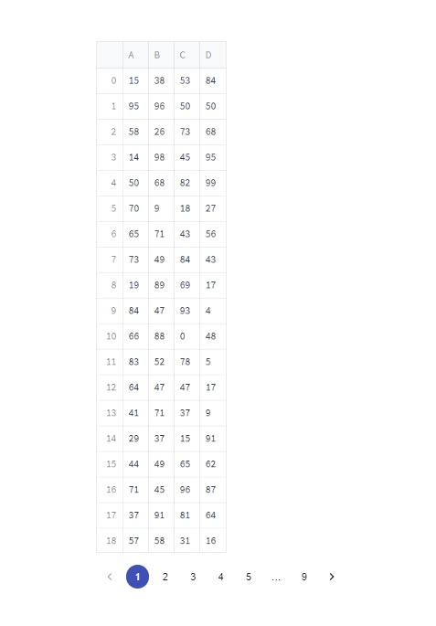

# streamlit-pagination
Mui pagination component to segment data by numbered pages


Its built on the streamlit custom components typescript template

To install it:

```
pip install streamlit-pagination
```

Variables
- dataLength: length of data that will be displayed (rows/index)
- layout: dictionary variable to determine what the layout of the mui component will look like including the style

You need to import the style file which adjusts the size of the iframe - it can be found [here](https://github.com/Socvest/streamlit-pagination/tree/main/streamlit_pagination).

```
import streamlit as st
import pandas as pd
import numpy as np
from streamlit_pagination import pagination_component

st.markdown('<style>' + open('./style.css').read() + '</style>', unsafe_allow_html=True)

words = ['light', 'bed', 'colorful', 'boiling', 'well-off', 'overrated', 'immense', 'hard', 'relieved', 'precious', 'ludicrous', 'eatable',  'cruel', 'discovery', 'sloppy', 'tray', 'disagreeable', 'telephone', 'lovely', 'godly', 'cause', 'pointless', 'theory', 'spooky', 'drop', 'bite-sized', 'reminiscent', 'wicked', 'hug', 'hate', 'ashamed', 'unused', 'jazzy', 'known', 'chief', 'disapprove', 'admit', 'gaping', 'vivacious', 'hollow', 'eight', 'popcorn', 'exciting', 'whimsical', 'faint', 'new', 'tire', 'pizzas', 'internal', 'effect', 'start', 'unarmed', 'worm', 'awake', 'string', 'humor', 'cautious', 'notebook', 'wide-eyed', 'month', 'same', 'cover', 'receive', 'clover', 'misty', 'step', 'dislike', 'vague', 'flat', 'neck', 'voice', 'stitch', 'apparatus', 'boundless', 'lunchroom', 'team', 'receipt', 'disagree', 'ruin', 'meeting', 'honorable', 'groovy', 'cherry', 'scissors', 'bizarre', 'steady', 'cannon', 'ship', 'soothe', 'mundane', 'verdant', 'tiger', 'request', 'home', 'quizzical',  'head', 'loving', 'interfere', 'argument', 'imported']

def random_char(y):
    
    return words[:y]

def data_chunk_choice():
    if 'foo' not in st.session_state:
        return 0
    return st.session_state['foo']
    
data = pd.DataFrame(np.random.randint(0,100,size=(1000, 4))), columns=list('ABCD'))

n = 100
list_df = [data[i:i+n] for i in range(0,data.shape[0],n)] 

data_l = list_df[data_chunk_choice()] 

st.dataframe(data_l, width=400, height=700)

layout = {  'color':"primary", 
            'style':{'margin-top':'10px'}}
test = pagination_component(len(list_df), layout=layout, key="foo")
```
 
